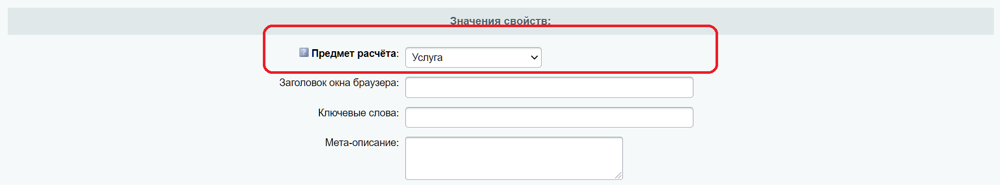
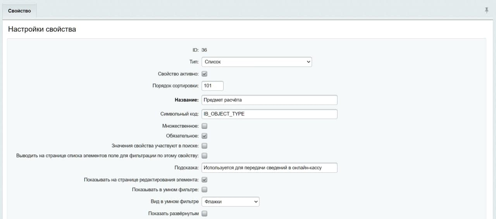
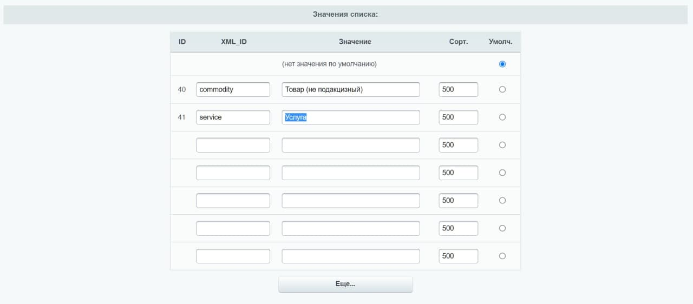

# Платёжный модуль «Инвойсбокс» для 1С Битрикс (Bitrix)

В платёжном модуле «Инвойсбокс» реализована поддержка платёжного API для CMS Битрикс. Протестировано на версиях Битрикс
с 16 по 20, в кодировке cp-1251 и utf-8.

Модуль позволяет организовать оплату товаров и услуг в магазине на редакциях «Малый бизнес», «Бизнес», «Интернет-магазин
CRM» через систему «Инвойсбокс». Система «Инвойсбокс» позволяет Интернет-магазину принимать оплату через популярные
инструменты - банковские карты, системы Интернет-банка, электронные деньги, терминалы, кассы банков и счета мобильных
телефонов. Оплата приходит на расчётный счёт компании или индивидуального предпринимателя. При работе с «Инвойсбокс»
Интернет-магазину не требуется покупать и обслуживать онлайн-кассу в соответствии с ФЗ-54, чеки для плательщиков
«Инвойсбокс» формирует за Интернет-магазин.

# Установка и настройка модуля «Инвойсбокс» на Bitrix

## Автоматическая установка модуля через MarketPlace

1. Зайдите в административную часть интернет магазина. Перейдите в раздел «MarketPlace» → «Установленные решения»;
2. Найдите модуль «Инвойсбокс» (Invoicebox, invoicebox.payment) и установите его;

## Ручная установка модуля (для экспертов)

1. Распакуйте архив. Скопируйте папку <strong>invoicebox.payment</strong> и всё её содержимое на Ваш сервер либо в
   папку <strong> \local\modules\ </strong> (если директории \local\modules\ не существует, то ее необходимо создать),
   либо в папку <strong> \bitrix\modules\ </strong>. Выбор папки производится на Ваше усмотрение, однако если у Вас
   используются на сайте и другие кастомные платежные системы, рекомендуем Вам расположить папку <strong>
   invoicebox.payment</strong> туда, где находятся и другие платежные системы.
2. Зайдите в административную часть Вашего сайта, перейдите на страницу <strong>«MarketPlace» → «Установленные
   решения»</strong>;
3. В списке доступных решений найдите модуль <strong>«Инвойсбокс» (Invoicebox, invoicebox.payment)</strong> и установите
   его .

### Примечания для упаковки модуля для разных версий (для экспертов)

Данная версия предназначена для публикации в Битрикс «MarketPlace». Все файлы закодированы в кодировке 1251. Данная
версия так же установится в ручную на версию Битрикс 1251.

Для создания пакета ручной установки для Битрикса UTF-8 необходимо все файлы перекодировать UTF-8 без BOM.

7 шагов для сборки новой версии, необходимо:

1. Внести актуальную информацию о версии модуля в файл: `invoicebox.payment\install\version.php`;
2. Внести актуальную информацию о версии модуля в файл: `invoicebox.payment\install\sale_payment\invoicebox\handler.php`;
3. Внести актуальную информацию о версии модуля в файл: `marketplace_update\description.ru`;
4. Создать папку с номером версии, например, 2.0.1;
5. Скопировать в папку с версией содержимое папки  `marketplace_update\description.ru`;
6. Скопировать в папку с версией содержимое папки `invoicebox.payment`, которое было изменено относительно предыдущей
   версии модуля;
7. Заархивировать папку с версией в файл ZIP таким образом, чтобы сама папка была основным элементом архива.

## Настройка модуля

В административном разделе сайта перейдите на страницу <strong>«Магазин» → «Платёжные системы»</strong> и нажмите на
кнопку «Добавить платёжную систему». На открывшейся странице:

- Выберите "Обработчик": <strong>«Инвойсбокс»</strong> (invoicebox);
- Выберите тип платежной системы: Инвойсбокс v2. Ваша версия v2;
- Если требуется, измените "Заголовок" и "Название";
- <strong>(обязательно)</strong> Укажите кодировку "UTF-8";
- <strong>(обязательно)</strong> Снимите, если установлены, 2 чекбокса "Разрешить печать чеков" и "Открывать в новом
  окне".

В блоке «Настройка обработчика ПС» настройте следующие параметры:

- В случае выбора в типе платёжной системы версии Инвойсбокс v2, требуется заполнить поля из блока «Настройки
  подключения к Инвойсбокс v2»:
    - ID магазина — укажите идентификатор магазина, полученный при заключении договора с «Инвойсбокс»;
    - Региональный код магазина — укажите региональный код магазина, полученный при заключении договора с «Инвойсбокс»;
    - API ключ — укажите ключ безопасности, полученный при заключении договора с «Инвойсбокс»;
    - URL страницы для отправки уведомлений — данный параметр обычно не требуется редактировать, т.к. он устанавливается
      по умолчанию и значение обязательно должно быть в виде https://адрес_
      сайта/bitrix/tools/invoicebox/notification.php;
    - Тестовый режим - включите его для проведения тестовых платежей, при включении этого режима, вы пройдете все шаги в
      платёжном терминале Invoicebox, но деньги с вашей карты списаны не будут
      
- В случае выбора в типе платёжной системы версии Инвойсбокс v3, требуется заполнить поля из блока «Настройки
  подключения к Инвойсбокс v3»:
    - Идентификатор магазина - укажите идентификатор магазина, полученный при заключении договора с «Инвойсбокс»;
    - Авторизационный токен - токен формируется в момент регистрации магазина в системе «Инвойсбокс» и направляется по
      электронной почте в письме «Об активации в системе «Инвойсбокс». В случае, если вы не получили данный токен, вы
      можете сформировать его автоматически в личном кабинете (в разделе Настройки);
    - Ключ для проверки подписи запроса — данный ключ можно получить в настройках интеграции магазина в ЛК «Инвойсбокс»;
    - Тип оплаты — выберите один из вариантов (Полная предоплата, Предоплата, Аванс, Полная оплата), данные поля
      необходимы для формирования чека;
    - URL страницы для отправки уведомлений — данный параметр обычно не требуется редактировать, т. к. он
      устанавливается по умолчанию и значение обязательно должно быть в виде https://адрес_
      сайта/bitrix/tools/invoicebox/notification_v3.php.
      
- Для любой выбранного типа платежной системы необходимо заполнить настройки в блоки «Основная»:
    - Предмет расчёта у товаров по-умолчанию, Предмет расчёта у доставки — выберите один из двух вариантов (Товар или
      Услуга), данные поля необходимы для формирования корректного чека. Это значение будет использоваться по-умолчанию,
      если свойство не заполнено в карточке товара;
    - НДС на товары, НДС на доставку — выберите один из вариантов (не облагается, НДС 0%, НДС 10%, НДС 20%, НДС брать из
      информации в товаре/ НДС брать из настроек доставки), данные поля необходимы для формирования чека;
    - Автоматически оплачивать заказ при получении успешного статуса - при включении режима как только на сайт будет
      поступать информация об успешной оплате, заказ автоматически будет оплачиваться;
    - URL страницы для возврата на сайт Магазина — при необходимости отредактируйте путь к странице для возврата на сайт
      Магазина;
    - URL страницы возврата при успешной оплате — при необходимости отредактируйте путь к странице, на которую попадет
      покупатель после успешной оплаты;
    - URL страницы возврата при отмене оплаты - при необходимости отредактируйте путь к странице, на которую попадет
      покупатель в случае отмены оплаты.
      

При необходимости откорректируйте параметры в блоке «Оплаты»:

- Единица измерения (по-умолчанию);
- Описание оплаты;
- Номер оплаты;
- Сумма оплаты;
- Валюта счёта;
- Дата создания оплаты;
- Статус после которого можно будет оплатить заказ — если вам требуется отложенный платеж, выберите после какого статуса
  заказа разрешена будет оплата.

В блоке «Покупатель» настройте следующие данные:

- Тип плательщика — выберите один из вариантов (Физическое лицо, Юридическое лицо);
- Название покупателя — для физических лиц рекомендуем указывать поля ФИО, для юридических лиц — название организации;
- Телефон покупателя;
- ИНН покупателя — рекомендуется передавать для юридических лиц;
- Юр. адрес — рекомендуется передавать для юридических лиц. При необходимости, Вы можете внести изменения в настройках
  для разных типов плательщиков, для этого перейдите на нужную вкладку ("Физические лица" или "Юридические лица") и
  внесите необходимую информацию.
  

## Предмет расчёта в свойствах товара

Обратите внимание, в процессе установки, модуль добавит дополнительное свойство к товару - «Предмет расчёта». На текущий
момент поддерживаются два значения «Товар (не подакцизный)» и «Услуга». Данное свойство необходимо для передачи
информации в онлайн-кассу и корректного формирования фискального чека.

В случае, если по каким-то причинам, в свойствах товара не появилось поле «Предмет расчёта», вы можете добавить такое поле
самостоятельно. Для этого, перейдите в раздел «Магазин – Свойства товаров» и нажмите на кнопку «Добавить свойство». В форме
необходимо заполнить следующие поля:
1. Тип: Список
2. Порядок сортировки: 101
3. Название: Предмет расчёта
4. Символьный код (обязательно, без пробелов): IB_OBJECT_TYPE
5. Обязательное: ДА (поставить галку)
6. Подсказка: Используется для передачи сведений в онлайн-кассу

7. Значения списка (заполните 2 строки):
    1. Строка 1:
        1. XML_ID: commodity
        2. Значение: Товар (не подакцизный)
    2. Строка 2:
        1. XML_ID: service
        2. Значение: Услуга
8. Нажмите кнопку «Сохранить»

## Настройка интернет-магазина

В административном разделе сайта перейдите на страницу <strong>«Настройки» → «Настройки продукта» → «Настройки модулей»
→ «Интернет-магазин»</strong> и во вкладке <strong>«Автоматизация процессов»</strong> настройте смену статусов заказа
при получении оплаты.

## Настройка в личном кабинете «Покупатель»

1. Перейдите в свой личный кабинет https://business.invoicebox.ru/ и авторизуйтесь.
2. Перейдите в раздел <strong>«Мои продажи» → «Мои магазины»</strong> во вкладке <strong>«Интеграция (API)»</strong>:
    - Выберите «Тип уведомления»: <strong>"Оплата/HTTP/Post (HTTP POST запрос с данными оплаты в переменных)"</strong>;
    - В поле "URL уведомления" укажите адрес Вашего сайта <strong>https://<адрес_вашего_сайта>
      /bitrix/tools/invoicebox/notification.php</strong>;
    - Проверьте корректность работы получения уведомления, нажав на кнопку «Отправить тестовый запрос»;
    - После проверки нажмите на кнопку «Сохранить».

