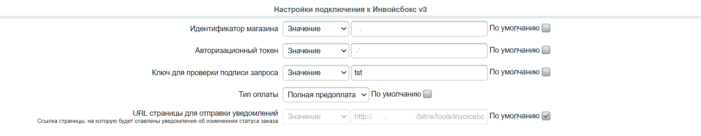
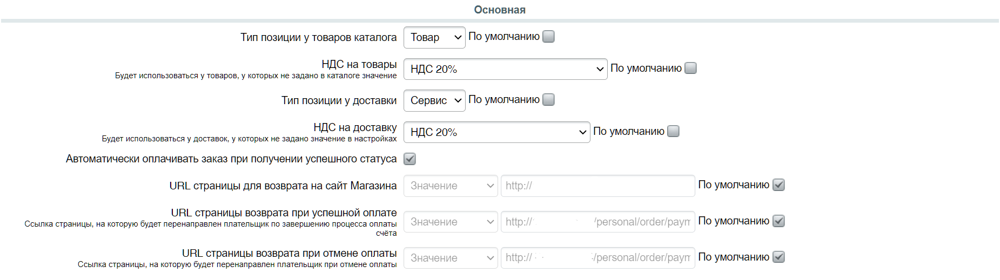

# 1c-bitrix
# Описание платежного модуля ИнвойсБокс для 1C-Bitrix

Платёжный модуль Битрикс для интеграции платёжной системы «ИнвойсБокс» и CMS Битрикс. Реализована поддержка платёжного API. Протестировано на версиях Битрикс с 16 по 20, в кодировке cp-1251 и utf-8. 

Модуль позволяет организовать оплату товаров в магазине на редакциях «Малый бизнес», «Бизнес», «Интернет-магазин + CRM» через систему «ИнвойсБокс». Система «ИнвойсБокс» позволяет Интернет-магазину принимать оплату через популярные инструменты - банковские карты, системы Интернет-банка, электронные деньги, терминалы, кассы банков и счета мобильных телефонов. Оплата приходит на расчётный счёт компании или индивидуального предпринимателя.
При работе с «ИнвойсБокс» Интернет-магазину не требуется покупать и обслуживать онлайн-кассу в соответствии с ФЗ-54, чеки для плательщиков «ИнвойсБокс» формирует за Интернет-магазин.

# Установка и настройка модуля ИнвойсБокс на Bitrix

## Установка модуля

1. Распакуйте архив. Скопируйте папку <strong>invoicebox.payment</strong> и всё её содержимое на Ваш сервер либо в папку <strong> \local\modules\ </strong> (если директории \local\modules\ не существует, то ее необходимо создать), либо в папку <strong> \bitrix\modules\ </strong>. Выбор папки производится на Ваше усмотрение, однако если у Вас используются на сайте и другие кастомные платежные системы, рекомендуем Вам расположить папку <strong>invoicebox.payment</strong> туда, где находятся и другие платежные системы.
2. Зайдите в административную часть Вашего сайта, перейдите на страницу <strong>«MarketPlace» → «Установленные решения»</strong>;
3. В списке доступных решений найдите модуль <strong>«ИнвойсБокс» (InvoiceBox, invoicebox.payment)</strong> и установите его .

### Примечания для упаковки модуля для разных версий

Данная версия предназначена для публикации в маркетплейсе Битрикс. Все файлы закодированы в кодировке 1251. Данная версия так же установится в ручную на версию Битрикс 1251.

Для создания пакета ручной установки для Битрикса UTF-8 необходимо все файлы перекодировать UTF-8 без BOM.

## Настройка модуля

В административном разделе сайта перейдите на страницу <strong>«Магазин» → «Платёжные системы»</strong> и нажмите на кнопку «Добавить платёжную систему». На открывшейся странице:
   - Выберите "Обработчик": <strong>«ИнвойсБокс»</strong> (invoicebox);
   - Выберите тип платежной системы: ИнвойсБокс v2 или ИнвойсБокс v3;
   - Если требуется измените "Заголовок" и "Название";
   - <strong>(обязательно)</strong> Укажите кодировку "UTF-8";
   - <strong>(обязательно)</strong> Снимите, если установлены, 2 чекбокса "Разрешить печать чеков" и "Открывать в новом окне". 

В блоке «Настройка обработчика ПС» настройте следующие параметры:
   - В случае выбора в типе платежной системы версии ИнвойсБокс v2 требуется заполнить поля из блока «Настройки подключения к ИнвойсБокс v2»:
     - ID магазина — укажите идентификатор магазина, полученный при заключении договора с «ИнвойсБокс»;
     - Региональный код магазина — укажите региональный код магазина, полученный при заключении договора с «ИнвойсБокс»;
     - API ключ — укажите ключ безопасности, полученный при заключении договора с «ИнвойсБокс»;
     - URL страницы для отправки уведомлений — данный параметр обычно не требуется редактировать, т. к. он устанавливается по умолчанию и значение обязательно должно быть в виде http(s)://адрес_сайта/bitrix/tools/invoicebox/notification.php;
     - Тестовый режим - включите его для проведения тестовых платежей, при включении этого режима, вы пройдете все шаги в платежном терминале Invoicebox, но деньги с вашей карты списаны не будут
     
   - В случае выбора в типе платежной системы версии ИнвойсБокс v3 требуется заполнить поля из блока «Настройки подключения к ИнвойсБокс v3»:
     - Идентификатор магазина -  укажите идентификатор магазина, полученный при заключении договора с «ИнвойсБокс»;
     - Авторизационный токен - токен формируется в момент регистрации магазина в системе «Инвойсбокс» и направляется по электронной почте в письме «Об активации в системе «Инвойсбокс». В случае, если вы не получили данный ключ, вы можете сформировать его автоматически в личном кабинете (в разделе Настройки);
     - Ключ для проверки подписи запроса — данный ключ можно получить в настройках интеграции магазина в ЛК ИнвойсБокс;
     - Тип позиции у товаров каталога, Тип позиции у доставки — выберите один из двух вариантов (Товар или Сервис), данные поля необходимы для чека;
     - НДС на товары, НДС на доставку — выберите один из вариантов (не облагается, НДС 0%,. НДС 10%, НДСВ 20%, НДС брать из информации в товаре/ НДС брать из настроек доставки), данные поля необходимы для чека;
     - Тип оплаты — выберите один из вариантов (Полная предоплата, Предоплата, Аванс, Полная оплата), данные поля необходимы для чека;
     - URL страницы для отправки уведомлений — данный параметр обычно не требуется редактировать, т. к. он устанавливается по умолчанию и значение обязательно должно быть в виде http(s)://адрес_сайта/bitrix/tools/invoicebox/notification_v3.php.
     
   - Для любой выбранного типа платежной системы необходимо заполнить настройки в блоки «Основная»:
     - Автоматически оплачивать заказ при получении успешного статуса - при включении режима как только на сайт будет поступать информация об успешной оплате, заказ автоматически будет оплачиваться;
     - URL страницы для возврата на сайт Магазина  — при необходимости отредактируйте путь к странице для возврата на сайт Магазина;
     - URL страницы возврата при успешной оплате — при необходимости отредактируйте путь к странице, на которую попадет покупатель после успешной оплаты;
     - URL страницы возврата при отмене оплаты - при необходимости отредактируйте путь к странице, на которую попадет покупатель в случае отмены оплаты.
     

При необходимости откорректируйте параметры в блоке «Оплаты»:
   - Единица измерения (по-умолчанию);
   - Описание оплаты;
   - Номер оплаты;
   - Сумма оплаты;
   - Валюта счета;
   - Дата создания оплаты; 
   - Статус после которого можно будет оплатить заказ — если Вам требуется отложенный платеж, выберите после какого статуса заказа разрешена будет оплата.

	
В блоке «Покупатель» настройте следующие данные:
   - Тип плательщика — выберите один из вариантов (Физическое лицо, Юридическое лицо);
   - Название покупателя — для физических лиц рекомендуем указывать поля ФИО, для юридических лиц — название организации;
   - Телефон покупателя;
   - ИНН покупателя — рекомендуется передавать для юридических лиц;
   - Юр. адрес — рекомендуется передавать для юридических лиц.
При необходимости, Вы можете внести изменения в настройках для разных типов плательщиков, для этого перейдите на нужную вкладку ("Физические лица" или "Юридические лица") и внесите необходимую информацию.

## Настройка интернет-магазина

В административном разделе сайта перейдите на страницу <strong>«Настройки» → «Настройки продукта» → «Настройки модулей» → «Интернет-магазин»</strong> и во вкладке <strong>«Автоматизация процессов»</strong> настройте смену статусов заказа при получении оплаты.

## Настройка в личном кабинете ИнвойсБокс

1. Перейдите в свой личный кабинет https://login.invoicebox.ru/ и авторизуйтесь.
2. Перейдите в раздел <strong>«Начало работы» → «Настройки» → «Мои магазины»</strong> во вкладке <strong>«Уведомления по протоколу»</strong>:
   - Выберите «Тип уведомления»: <strong>"Оплата/HTTP/Post (HTTP POST запрос с данными оплаты в переменных)"</strong>;
   - В поле "URL уведомления" укажите адрес Вашего сайта <strong>http://<адрес_вашего_сайта>/bitrix/tools/invoicebox/notification.php</strong>;
   - Проверьте корректность работы получения уведомления, нажав на кнопку «Отправить тестовый запрос»;
   - После проверки нажмите на кнопку «Сохранить».

